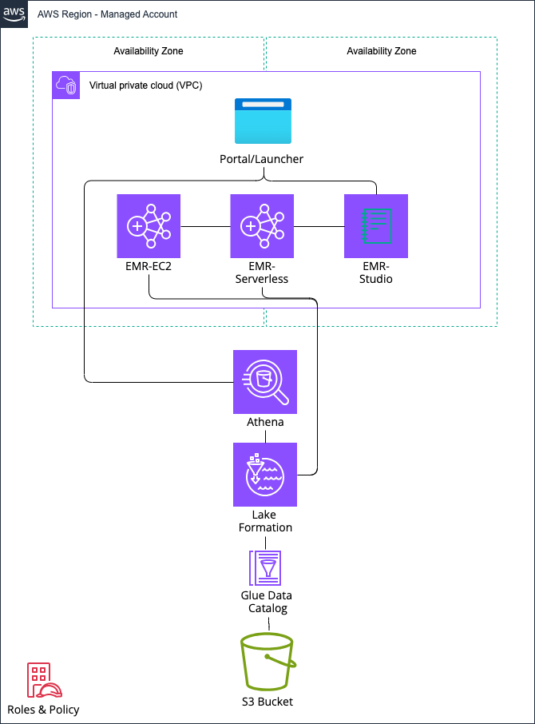

# Welcome to the Analytics POC Accelerator for AWS

## Analytics POC Accelerator for AWS

This tool aims to provide a simple way to deploy a Proof-of-Concept (POC) data lake with real-world use-cases across
Amazon EMR, Amazon Athena, and the AWS Glue Data Catalog.

It provisions and configures everything you need, along with sample real-world use cases.

## Overview

This repository contains a CDK stack for creating the infrastructure for an Analytics POC on AWS.

After creating the stack, you'll be able to:

- Import your own data into your AWS environment
- Experiment with EMR Serverless Spark, Athena SQL, and Athena Spark

## Architecture Built by this Project



This project creates an easy to use starter configuration for Analytics services on AWS, including:

- A VPC that spans 2 AZ's
- An S3 Bucket to store data
- A dataset from the NOAA public dataset
- Glue Data Catalog configuration with Database and Table for the public dataset
- Lake Formation Permissions configuration to secure Glue Data Catalog
- An Athena Workgroup
- An EMR Serverless Application
- An EMR on EC2 Cluster
- An EMR on EKS Virtual Cluster
- An EMR Studio Workspace
- System and IAM Users and Roles to secure the infrastructure
- ~A static website that enables you to launch EMR Studio and the AWS Web Console~

## Context / Vision

The idea behind the `AnalyticsPocStack` is that you can easily deploy a mixed and matched setup for running a Proof-of-Concept on top of AWS Analytics services including EMR, Athena, and Glue.

Based on feature flags in the stack, you enable what's most relevant to you and your (or your customer's) organization, deploy, and you've got some pre-built templates for getting started.

Regardless of which setup you choose, the relevant roles, buckets, policies, etc are deployed to your account. 

All of the deployed resources are also configured with reasonable defaults with a focus on least privilege permissions.

As an example, if you choose to use `createEMRCluster` and  `createEMRStudio`, an EMR on EC2 cluster is created with 
Runtime Roles enabled in addition to the required security configurations to support EMR Studio connectivity.
The created user has no access to the data on S3, but the runtime roles associated with the EC2 cluster does.

By default, a sample un-optimized S3 data source is created using the [NOAA Global Surface Summary of Day](https://aws.amazon.com/marketplace/pp/prodview-yyq26ae3m6csk#usage) dataset.


## Getting Started

### Requirements

- An AWS account with capacity for an extra VPC and Admin privileges
- Node.js 18.x with [CDK installed](https://docs.aws.amazon.com/cdk/v2/guide/getting_started.html)
- Python >=3.7x with [EMR CLI installed](https://github.com/awslabs/amazon-emr-cli)
  - `python3 -m pip install emr-cli`
- Docker, or [Finch](https://github.com/runfinch/finch) (requires setting environment variable, e.g.: `export CDK_DOCKER=finch`)
- Git

### Cloning the repo

Clone the repo and use `npm install` to install required dependencies.

```bash
git clone git@github.com:awslabs/analytics-poc-accelerator-for-aws.git
cd analytics-poc-accelerator-for-aws
npm install
```

Make sure you run `cdk bootstrap` if you haven't previously setup CDK. Be sure that your default AWS region matches the bootstrap region, e.g. `export AWS_REGION=<AWS_REGION>` or in your `.aws/config` file. You may also need to set the `AWS_DEFAULT_REGION` as well: `export AWS_DEFAULT_REGION=<AWS_REGION>`

```bash
cdk bootstrap aws://<AWS_ACCOUNT_ID>/<AWS_REGION>
```

### Deploy the stack

Simply run `cdk deploy --all  --outputs-file out.json` to deploy a sample EMR Serverless stack to your default AWS account/region. The stacks include:

```
ODAPOCInfra
AnalyticsPOCStack
```

The Infra stack deploys a VPC and S3 bucket. The AnalyticsPOCStack can create several different environments. By default, it creates an EMR Serverless application, EMR Studio, Athena workgroups, and a sample Glue database and table.

You can pick and choose different parts of the Analytics POC stack as well by using different context flags or by modifying [`bin/odapoc-cdk.ts`](./bin/odapoc-cdk.ts)

For example, to deploy an EMR on EC2 stack instead of EMR Serverless you can use the following command:

```bash
cdk deploy --all --outputs-file out.json --context emrdeployments=ec2
```

> **Note**: In this PoC, we grant the runtime roles associated with the different environments access to the data. With the exception of Athena, the user does not interact directly with the S3 data bucket.

## Advanced Use Cases

### Kinesis Streaming

Currently in preview, it is intended that the PoC can easily set up access to customer data sources in order to reduce the time to value as much as possible.

One such use-case is with existing Kinesis streams. In combination with the [EMR CLI](https://github.com/awslabs/amazon-emr-cli), this can make deploying and running a Spark Streaming EMR Serverless job as easy as:

```
cdk deploy --all --outputs-file out.json --context kinesisarns=arn:aws:kinesis:us-west-2:123456789012:stream/simple-demo && \
npm run emrcli -- --example kinesis-printer --runtime serverless && \
cd assets/kinesis-printer/ && \
emr run
```

This will start a Spark Streaming job using the [Spark SQL Kinesis Connector](https://github.com/awslabs/spark-sql-kinesis-connector) that simply does a count of unique records from the provided Kinesis stream.

### Data Importing

We also want to make it as easy as possible to run a data importer from standard formats like CSV, JSON, or Parquet to open table formats like Iceberg.

The [`penguin.py`](./assets/data-importer/penguin.py) script provides a generic import mechanism that can import CSV data into a new Iceberg table.

```
cdk deploy --all --outputs-file out.json --context emrdeployments=serverless && \
npm run emrcli -- --example data-importer --runtime serverless && \
cd assets/data-importer/ && \
emr run
```

> *Note*: Replace `serverless` with `ec2` if you deployed an EMR on EC2 cluster

The commands above will import a subset of [NOAA GSOD](https://registry.opendata.aws/noaa-gsod/) data into a `poc_default.noaa_berg` table.

### Using EMR Studio

EMR Studio now supports interactive access across EMR on EC2, EMR on EKS, and EMR Serverless.

This CDK stack creates the required runtime roles and security configurations to connect to EMR on EC2 and Serverless.

For EMR Serverless, you'll need to configure the application in EMR Studio and enable the "Interactive endpoint" option.
Feel free to start the application after doing this so it's ready for interactive commands.

Once this is done, you should be able to create a new workspace, connect to your `emr-poc` compute using the `AnalyticsPOC-*` role, fire up a PySpark notebook and read data:

```python
from pyspark.sql import SparkSession

df = spark.read.csv("s3://noaa-gsod-pds/2023")
df.show()
```

or read from the table if you created in the [Data Importing](#data-importing) step (EMR Serverless only).

Make sure you replace the bucket below with the one created by your CDK stack.

```
%%configure -f
{
    "conf": {
        "spark.jars": "/usr/share/aws/iceberg/lib/iceberg-spark3-runtime.jar",
        "spark.sql.catalog.dev.warehouse": "s3://odapocinfra-awspocdatabucket<UNIQUE_STACK_ID>/output/poc/iceberg/",
        "spark.sql.extensions": "org.apache.iceberg.spark.extensions.IcebergSparkSessionExtensions",
        "spark.sql.catalog.dev": "org.apache.iceberg.spark.SparkCatalog",
        "spark.sql.catalog.dev.catalog-impl": "org.apache.iceberg.aws.glue.GlueCatalog",
        "spark.hadoop.hive.metastore.client.factory.class": "com.amazonaws.glue.catalog.metastore.AWSGlueDataCatalogHiveClientFactory"
    }
}
```

```python
spark.sql("SELECT year(date) AS year, AVG(temp) AS avg_temp FROM dev.poc_default.noaa_berg_seattle GROUP BY 1 ORDER BY 1 ASC").show()
```
